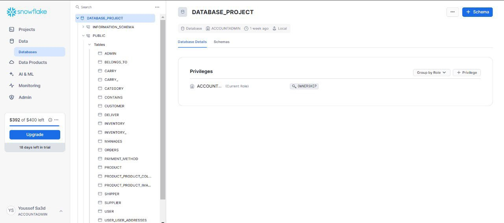
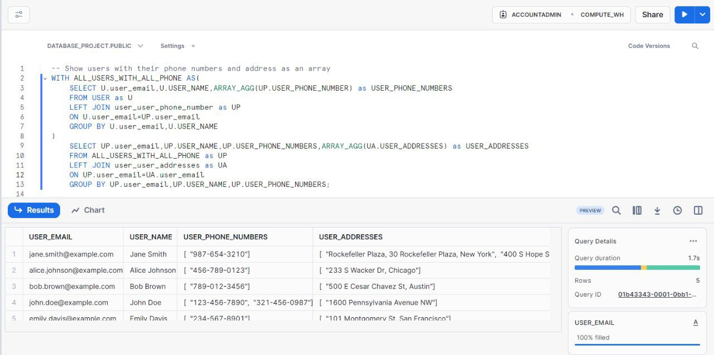

  <h1> E-Commerce Database Project</h1>
  
  
  

  <h3>  Unleash the Power of Your Online Store: Build a Database Engine with Smart Search for Effortless Sales and Scalability!</h3>
  
  

## :star2: About The Project

Here's a breakdown of the key components:
- **User Accounts**: user account information, it includes login credentials, account details, and potentially preferences, where the user of the e-commerce can be even customer or supplier who supplies the products or even the admin controlling it.
- **Products**: the products being sold. It typically includes atributes like product ID (unique identifier), name, description, category, price, stock availability, images, and other relevant product details.
- **Orders**: information about customer orders. It includes atributes like order ID, customer ID (linked to the Customers table), order date, order status (e.g., pending, shipped, cancelled), total amount, and potentially shipping details.
- **Inventory**: It tracks the number of items available for each product, ensuring accurate stock levels.
- **Payments**: payment information for each order, including payment ID, order ID (linked to the Orders table), payment method (e.g., credit card, debit card), payment status, and transaction details.
- **Carts**: to store items customers add to their shopping cart before checkout ; It can be linked to the Customers and track the chosen products and quantities.
- **Shipper**: More commonly in e-commerce, a shipper refers to a third-party logistics (3PL) provider. This is a part that specializes in shipping products.

## 📈 Diagrams

ER(Entity-Relationship) Diagram:

Relational Schema:

## 🧰 Usage

- Diagrams Built with [ERD Plus](https://erdplus.com/)
- Example Screenshots:

  

